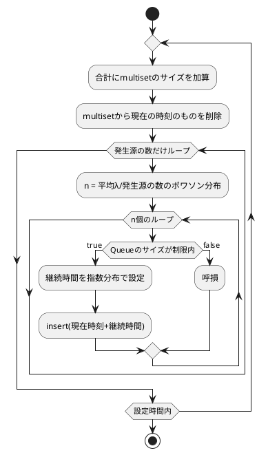

# ネットワーク性能の評価

## 課題

到着率λを変化させた時の

- 呼損率
- スループット

### 条件

- リンク容量: 100Mbps
- 呼辺りの帯域: 64Kbps
- 呼の到着率: 平均λのポアソン分布
- 呼の継続時間: 平均180秒の指数分布
- 発生源：1000, 10000(合計到着率がλ)

## メモ

- 到着率λ = 単位時間に到着する人数
- 発生源が複数: 合計到着率λ = Σλi

## 疑問

- 通信中の発生源は新たに通信してもいい？
- 一つの発生源から同時に複数の呼が発生していい？

## リンク

- [ポワソン分布](https://cpprefjp.github.io/reference/random/poisson_distribution.html)
- [指数分布](https://cpprefjp.github.io/reference/random/exponential_distribution.html)
- [待ち行列全般](http://www.kogures.com/hitoshi/webtext/or-que-mm1n/index.html)
